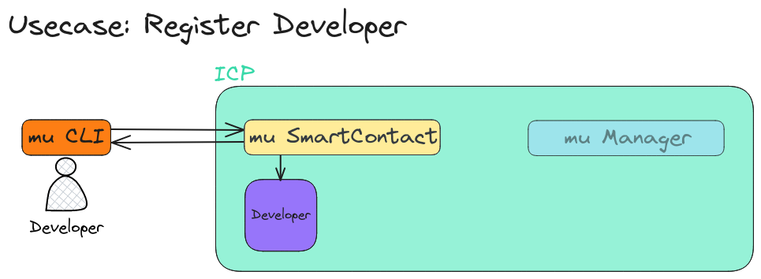
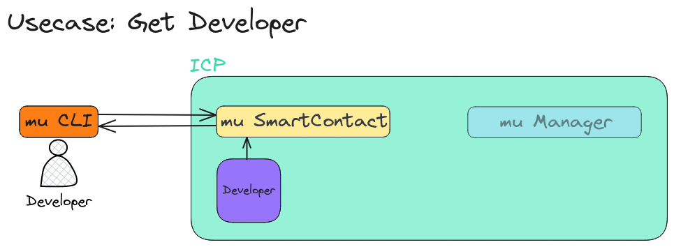
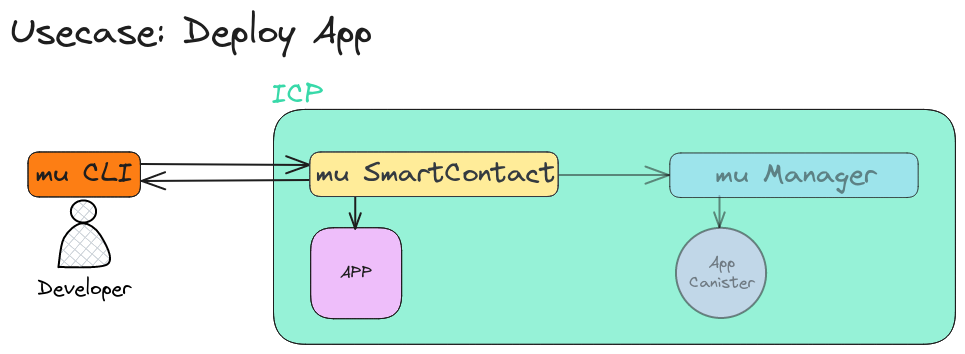
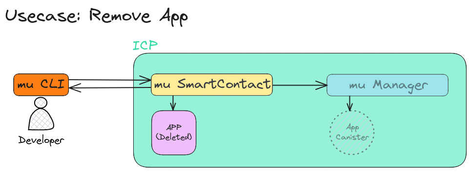
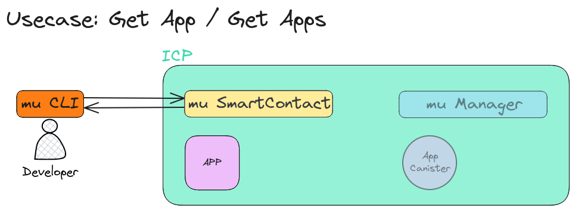
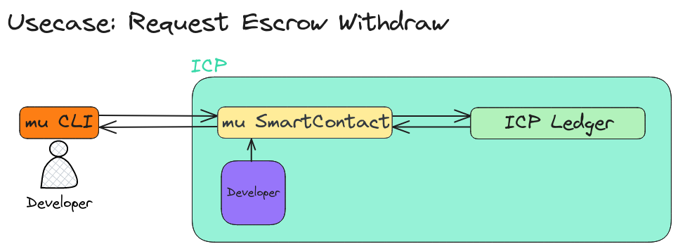
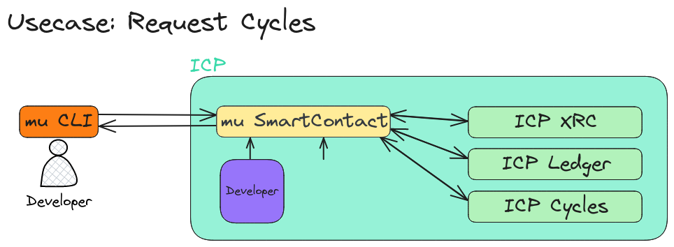

# mu Smart Contract Canister: The Trusted Source for Master Data

This canister serves as the central repository for critical information,
acting as the single source of truth for entities like developers,
applications, and escrow accounts.

It also tracks usage of additional services such as KV Store and Blob Storage.
Developer Control Gateway

The canister acts as a bridge between developers and their application code.
It empowers developers with granular control over their applications,
including managing usage and other aspects.

## Current Services

- **Register Developer**: This service registers new developers and creates
    a dedicated ledger sub-account as their escrow.
    This account tracks usage charges associated with additional canister
    services employed within their applications.
- **Get Developer**: This service retrieves information about a registered developer.
- **Deploy App (Beta)**: This service allows uploading and storing application
    code (serialized along with the manifest file, facilitated by the mu CLI
    or mu Dashboard website).
    Note that deploying the app as a canister on the ICP network is not
    currently supported, but this functionality will be available upon
    completion of the second milestone ("mu manager canister").
- **Remove App (Beta)**: This service allows removing an application;
    however, similar to deployment, app undeployment from the ICP network
    is not supported yet.
    This functionality awaits the completion of the "mu manager canister" milestone.
- **Get App(s)**: This service retrieves applications submitted by a specific developer.
    Apps can be in either an Active or Deleted state.
- **Request Escrow Withdraw**: This service allows developers to withdraw
    ICP tokens they previously deposited into their escrow account.
- **Request Cycles (Exclusive to Apps)**: Apps can request more cycles be
    transferred for them.
    This functionality allows a developer to have one escrow account filled
    with ICP tokens and multiple apps that can request cycles as needed.

## Future Services

As the project progresses and other components are developed, the following services will be implemented:

- **Report Usage (Coming Soon)**: This function, utilized by the "mu manager canister,"
    reports the usage of additional services and their canisters.
    It will automatically top-up the cost of canisters using estimated
    usage from the developer's escrow account, allowing for automatic deductions
    and service termination when the escrow balance reaches zero.
- **Deploy App with Upgrades**: This enhanced service will allow both deploying
    new apps and upgrading existing ones, including deploying apps as canisters on the ICP network.
- **Request Cycles Escrow Withdraw**: This service will allow developers to
    withdraw cycles from their cycles escrow account.

## Architecture Details

- **Register Developer**: Developers can use the mu CLI to issue the `register_developer` call.
    This creates a developer account with a ledger sub-account for their escrow balance.
    

- **Get Developer**: Developer information is retrieved from the state,
    and an AccountIdentifier is created from their sub-account to facilitate easy deposits into their escrow account.
    This identifier utilizes the canister ID for restricted access.
    

- **Deploy App (Beta)**:
    Developers can deploy new apps (with update functionality to be added in the future).

    They use the mu CLI to build their applications into WebAssembly (WASM)
    modules and combine them with the mu-manifest file within their project
    before sending it to the mu smart contract canister.

    Upon receiving the app, the system checks developer quota and minimum balance for deployment.

    If everything is clear, the system modifies the WASM module,
    adding ICP bindings and controller code for automatic cycle requests
    back to the canister when the balance is low.

    Finally, the modified WASM module is deployed as a canister on the ICP network.

    

- **Remove App (Beta)**:
    Currently, this service only deletes apps.

    However, after the second milestone (when apps are deployed as canisters),
    a separate escrow account will be introduced to hold converted ICP tokens (cycles) upon app removal.

    

- **Get App(s)**:
    This service retrieves a list of all apps, including both active and deleted ones,
    along with their detailed usage information.

    

- **Request Escrow Withdraw**:
    This service allows developers to withdraw ICP tokens previously deposited into their escrow account.

    

- **Request Cycles**:
    Apps (canisters) can request more cycles to be transferred into their cycles account.

    The exchange rate for converting ICP tokens into cycles is maintained
    using the Exchange Rate canister on the NNS.

    
